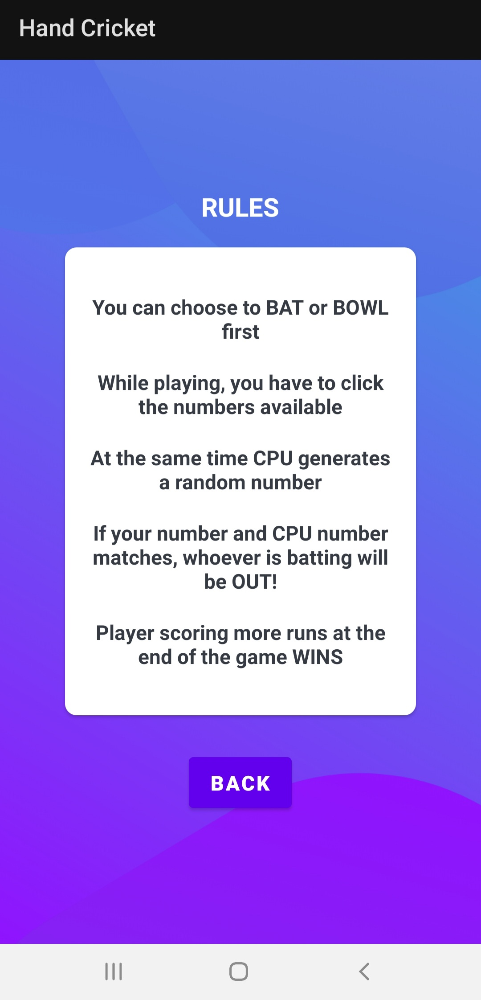
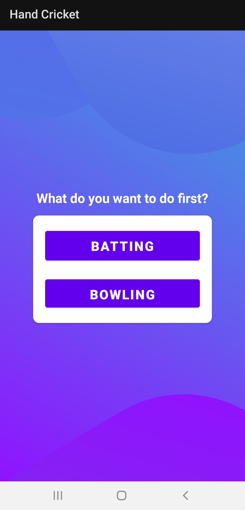
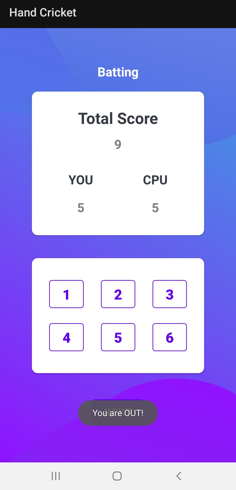
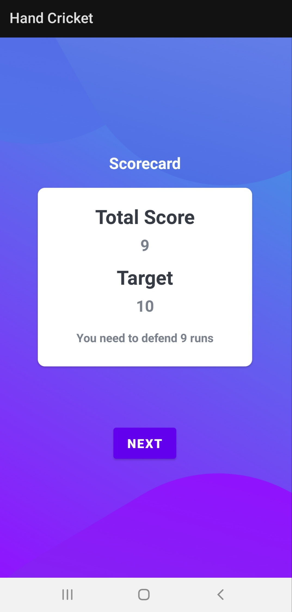
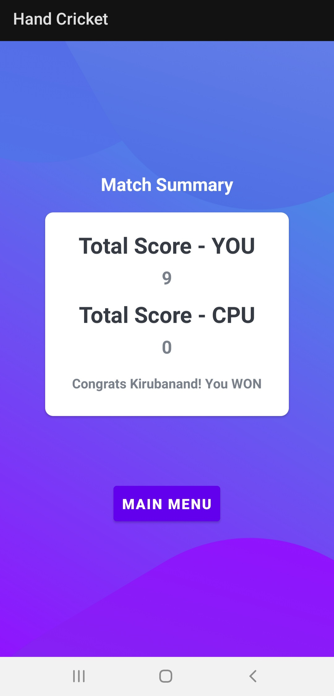

# Hand-Cricket
A simple game app based on the rules of "Hand Cricket" developed using TextViews, EditViews, Buttons, Intents, CardViews and Kotlin's Random class to generated random numbers in the range [1 , 6].

## Screenshots of the App
<table>
<tr>
<td>  </td>
<td>  </td>
<td>  </td>
</tr>
<tr>
<td>  </td>
<td>  </td>
<td>  </td>
</tr>
<tr>
<td>  </td>
<td>  </td>
</tr>
</table>
