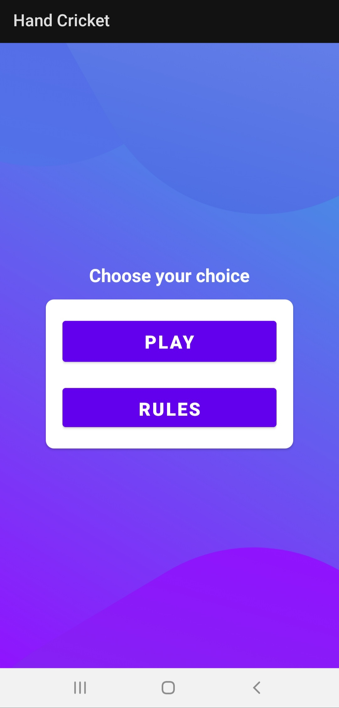

# Hand-Cricket
A simple game app based on the rules of "Hand Cricket" developed using TextViews, EditViews, Buttons, Intents, CardViews and Kotlin's Random class to generated random numbers in the range [1 , 6].

## Rules of the Game
- This is a `single player` based game, and `CPU` is your opponent.
- The player can either choose to `Bat` or `Bowl` first.
- While playing, the player can click any one of the numbers `[1 , 2 , 3 , 4 , 5 , 6]` available, and CPU will also generate a number in the range [1 , 6] simultaneously.
- If both the `numbers match`, whoever is Batting (either YOU or the CPU) will be `OUT`, else the number is added to the total score.
- At the end, whoever scored most runs will win the match.

## Screenshots of the App
<table>
  <tr>
    <td>  </td>
    <td>  </td>
    <td>  </td>
  </tr>
  <tr>
    <td>  </td>
    <td>  </td>
    <td>  </td>
  </tr>
  <tr>
    <td>  </td>
    <td>  </td>
  </tr>
</table>
